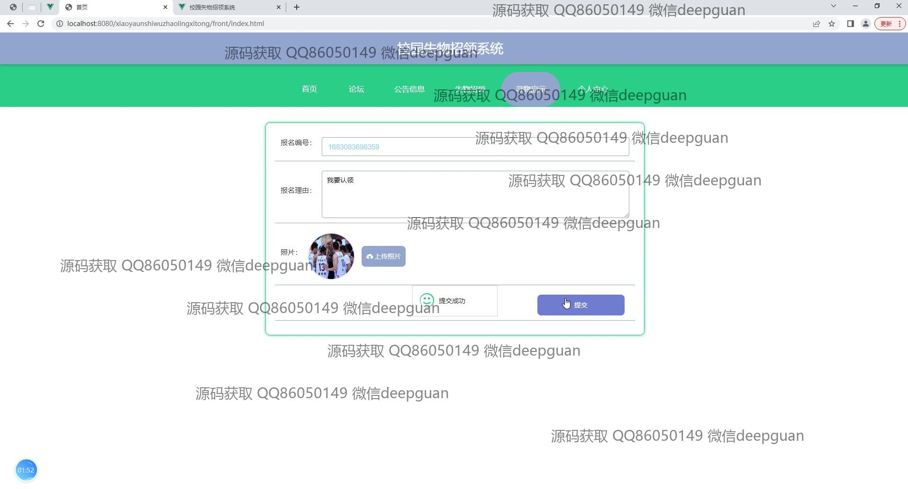

<h1 align="center">校园失物招领系统</h1>

## 简介
校园失物招领系统：管理员与用户角色分明；系统功能涵盖失物登记、查找、认领、发布寻物启示及信息审核管理，旨在通过Spring Boot平台简化校园内失物找回过程，提高查找与管理效率。    --计算机毕业设计源码；毕设源码；java毕业设计源码

## 联系方式

<h3 align="center">获取完整代码与数据库文件 + 微信：deepguan QQ: 86050149 QQ群: 783742310</h3>

<h3 align="center">可帮忙远程部署 包运行成功！提供远程部署、修改代码、设计文档指导、代码讲解等服务！</h3>

## 功能介绍（完整见运行截图）
管理员：管理员可以通过管理页面对失物类型、用户、公告信息、失物招领等进行管理和操作，包括新增、修改、删除和审核等功能。同时可以查看和管理论坛信息，并上传和管理首页轮播图，以确保信息的实时更新和完整性，帮助用户快速找到和认领遗失物品。

用户：用户可以访问网站首页，通过导航栏快速浏览不同模块，如失物招领、寻物启示、个人中心等。用户可以发布失物信息，查看失物详情，进行失物查询，并在论坛上与其他用户互动和交流。在个人中心，用户可以管理个人信息、查看失物认领记录、以及提交和管理自己的失物报告，便于高效解决失物问题。

审核者：审核者角色负责对用户提交的失物信息进行审核。审核者可以查看物品的详细信息，包括用户联系方式、失物地点和时间等。通过审核弹窗，审核者可以选择审核状态并输入审核意见，确保系统中的信息真实有效，并在必要时提供反馈。

浏览者：浏览者可以无需注册或登录即可访问部分展示性的模块如论坛和公告信息，浏览已发布的失物或寻物启示，但不能进行交互操作如发布或认领。他们可以通过网站提供的搜索功能，按关键字、时间段或地点等进行信息查询，快速获取所需的失物信息。

## 运行截图

本代码来源于网络,仅供学习参考使用!

